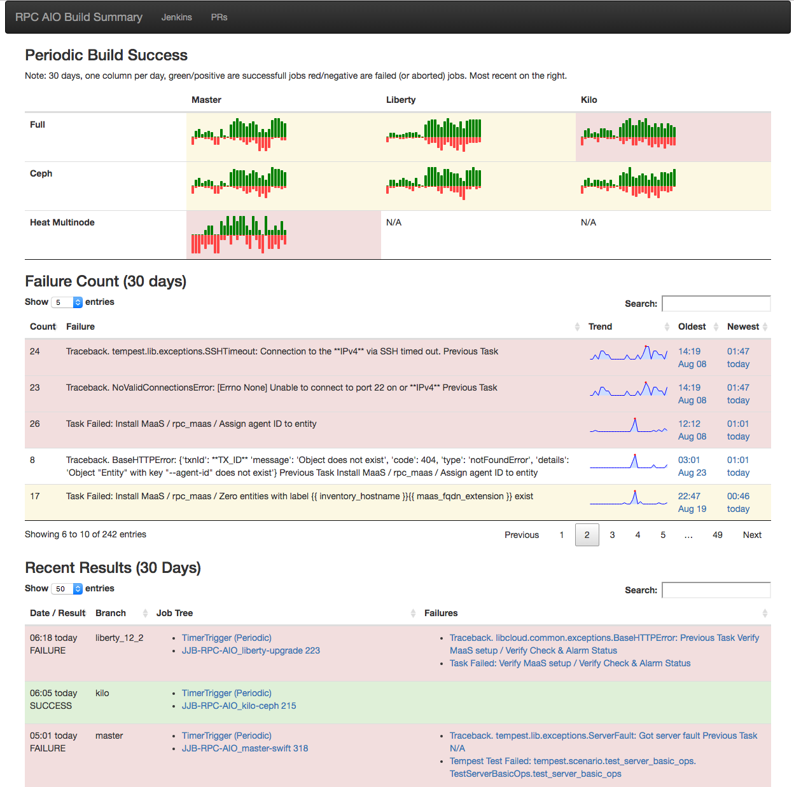

# RPC-Openstack Gating

## Linting
Linting is checking the syntax and style of the code without executing it. RPC Lint jobs are run by [Travis CI](https://travis-ci.org/).

### Linting Job Mechanics
  1. [rcbops/rpc-openstack](https://github.com/rcbops/rpc-openstack) has the travis integration enabled. This creates a webhook that posts [PR](https://github.com/rcbops/rpc-openstack/pulls) notifications to Travis. Note that the webhook isn't visible in the [github ui](https://github.com/rcbops/rpc-openstack/settings/hooks), as there is an official integration.
  1. Travis reads [.travis.yml](https://github.com/rcbops/rpc-openstack/blob/master/.travis.yml) which defines setup steps, the python versions to use and tox as the test runner.
  1. Tox reads [tox.ini](https://github.com/rcbops/rpc-openstack/blob/master/tox.ini) which defines two environments:
      1. [flake8](https://gitlab.com/pycqa/flake8) which runs      [scripts/linting-pep8.sh](https://github.com/rcbops/rpc-openstack/blob/master/scripts/linting-pep8.sh) to check for ansible style violations.
      1. [ansible-lint](https://github.com/willthames/ansible-lint) which runs [scripts/linting-ansible.sh](https://github.com/rcbops/rpc-openstack/blob/master/scripts/linting-pep8.sh). This script runs flake8 over all files with a python [shebang](https://en.wikipedia.org/wiki/Shebang_(Unix)) to check for python style violations.
  1. Once travis has completed it posts results back to github via the API, and github displays them in the PR.

## Functional Tests
Functional tests are defined using [Jenkins Job Builder](http://docs.openstack.org/infra/jenkins-job-builder/) in the [jenkins-rpc](https://github.com/rcbops/jenkins-rpc/tree/master/rpc-jobs) repo.
Jenkins jobs builder translates YAML job descriptions into Jenkins job configuration. This allows job config to be stored in a repo in a readable format.

Note that some jobs have not yet been migrated to JJB and are defined in Jenkins directly.
### Jenkins Job Mechanics
  1. [rcbops/rpc-openstack](https://github.com/rcbops/rpc-openstack) has a webhook configured to notify Jenkins of new/updated PRs.
  1. Jenkins has the [github pull request builder (ghprb)](https://wiki.jenkins-ci.org/display/JENKINS/GitHub+pull+request+builder+plugin) plugin enabled. This interprets the received webhook and kicks off the necessary job.
  1. Once the job has completed, jenkins posts the results back to github via the API, and github displays them in the PR.

### Jenkins Jobs

###### JJB-RPC-AIO-*
These jobs are all instances of the same JJB [Job Template](https://github.com/rcbops/jenkins-rpc/blob/master/rpc-jobs/jobs.yaml#L98). They are instantiated using a [project](http://docs.openstack.org/infra/jenkins-job-builder/definition.html#project), which is currently a 2x4 matrix (swift,ceph)x(kilo,liberty,mitaka,master). See [JJB-RPC-AIO_master-swift](http://jenkins.propter.net/job/JJB-RPC-AIO_master-swift/) as an example.

Each matrix combination provides its axis as variables but can also supply other variables to the job template. these values are used as string substitutions when JJB creates the compiled job configs. These variables are not available at job runtime. In order to pass a JJB template var into the environment of a running job, the env inject plugin is used. Defaults for these values are also supplied in the [first section of the job template](https://github.com/rcbops/jenkins-rpc/blob/master/rpc-jobs/jobs.yaml#L99).

Credentials are stored in Jenkins global configuration, which is not yet in SCM. The AIO job template defines mappings from stored credential IDs to environment variables. This mechanism is used to inject MaaS credentials.

JJB allows native Jenkins xml configuartion to be inserted as raw sections. This is useful in situations where there isn't a JJB module for a Jenkins plugin, or the JJB module isn't working correctly. Raw is used in two places:  
  * Jclouds single use slave. This option isn't supported by JJB, but is critical as it ensures that instances are not reused.
  * Inactivity Timeout - The XML generated by JJB is not supported by the current version of the Jenkins Timeout Plugin, so raw configuration is used.

JJB-RPC-AIO jobs are configured to run on slaves with the label 'rpcaio', these are single use instances supplied by the [jenkins-jclouds](https://wiki.jenkins-ci.org/display/JENKINS/JClouds+Plugin). They are created on demand and destroyed after they have executed one job.

The main block of this job is a shell task which does three things:
  1. Check for code changes and abort if none are found. This is a shortcut for docs-only PRs. This does not apply to jobs triggered by timer.
  1. Clone [jenkins-rpc](https://github.com/rcbops/jenkins-rpc) and run [aio_build_script.sh](https://github.com/rcbops/jenkins-rpc/blob/master/scripts/aio_build_script.sh). aio_build_script does the following:
      1. Clone rpc-openstack, checkout the older version required by the job parameters
      1. Run the [RPC deploy script](https://github.com/rcbops/rpc-openstack/blob/master/scripts/deploy.sh).
      1. Run tempest by attaching to the local utility container and running /opt/[openstack_tempest_gate.sh](https://github.com/openstack/openstack-ansible-os_tempest/blob/master/templates/openstack_tempest_gate.sh.j2). The test set is specified as a job parameter, and may vary from job to job. Results are copied to the tempest log directory which is bind mounted into the utility container from the host.
      1. If running an upgrade:    
          1. Checkout the newer version of RPC.
          1. Run the deploy script or upgrade script depending on the type of upgrade (the upgrade script is only used for major upgrades).
          1. Run tempest
  1. Log collection: The logs are copied to the Jenkins workspace on the slave. Jenkins then handles copying the logs from the slave workspace to the master before the slave is destroyed. The [jenkins junit](https://wiki.jenkins-ci.org/display/JENKINS/JUnit+Plugin) interprets the tempest results and displays graphs and [test information](http://jenkins.propter.net/job/RPC-AIO/lastCompletedBuild/testReport/).
      1. The slave is de-registered and the instance deleted.

###### Multinode
  1. [RPC-Training-Multinode](http://jenkins.propter.net/job/RPC-Training-Multinode/). This job builds multi node deployments using heat templates and cloud instances. The [heat templates](https://github.com/rcbops/rpc-heat-ansible/tree/master) are a modified version of the [cloud training templates developed by Byron Mccollum](https://github.com/cloud-training/rpc-heat-ansible). This job runs directly on the Jenkins master as the majority of the work happens in instances created by heat. The build is started by running the [build script](https://github.com/rcbops/rpc-heat-ansible/blob/master/jenkins/build.sh). Which does the following:
      1. Install python-heatclient
      1. Source pub cloud creds from the Jenkins master
      1. Create a stack on public cloud passing from the [template](https://github.com/rcbops/rpc-heat-ansible/blob/master/templates/rpc-ha-full-ceph.yml), a list of tags, maas-credentials and some variables defined in the Jenkins job are passed in. The tags specify which tasks are run from the [playbooks](https://github.com/rcbops/rpc-heat-ansible/blob/master/playbooks/rpc-12.0-playbook.yml) within rpc-heat-ansible. Heat creates the resources as specified in the template. This includes dropping a script on infra1 called [runcmd-bash](https://github.com/rcbops/rpc-heat-ansible/blob/master/templates/rpc-ha-full-ceph.yml#L350-L422). A tmux session is started which runs runcmd-bash, which does the following:
          1. Install ansible
          1. Clone rpc-heat-ansible (to get the playbooks)
          1. Run the [playbook](https://github.com/rcbops/rpc-heat-ansible/blob/master/playbooks/rpc-12.0-playbook.yml) This playbook does all the host setup pre-OSA including:
              1. Configure swap
              1. Prepare partition for storage
              1. Install packages
              1. Check connectivity between Nodes
              1. Clone RPC
              1. Template RPC Configuration files
              1. Install RPC (by running the [RPC deploy script](https://github.com/rcbops/rpc-openstack/blob/master/scripts/deploy.sh)
      1. Run tempest (SSH to infra1, lxc-attach to the utility container, run openstack_tempest_gate)
      1. SCP logs & test results from the infra1 instance back to the Jenkins workspace. Jenkins then handles archiving logs from the workspace.
      1. Delete the stack to free resources.

#### Other Jobs:
  1. [RPC-AIO Build Summary](http://jenkins.propter.net/job/RPC-AIO%20Build%20Summary/): Generates a [dashboard](http://jenkins.propter.net:443/#) for results. This dashboard has three sections:
      1. Periodic Success: Shows how successful periodic jobs have been over the last 30 days (bar chart) and 48 hours (background colour). This is a good indication of current gate stability as periodic job stats are not pulled down by PR errors. Each column represents a day with the green bars showing the count of successful builds and red bars showing the count of failed/aborted builds.
      1. Recent Failures: This shows the most recent failures and their trend. This table is sorted by newest by default and can be filtered on any field.
      1. Recent Results: This shows the last 30 days of results. This table is sorted by most recent can can be filtered on any field.
  
  1. [RPC-Upgrade-Matrix](http://jenkins.propter.net/job/RPC-Upgrade-Matrix/): Job which works out valid upgrade paths for master, active branches and previous major release. Each upgrade path is tested via an RPC-AIO job, which deploys the older version, runs tempest, then upgrades to the newer version and re-runs tempest.
  1. [JJB-Jenkins-RPC-PR-aio](http://jenkins.propter.net/job/JJB-Jenkins-RPC-PR-aio/), [JJB-Jenkins-RPC-PR-upgrade](http://jenkins.propter.net/job/JJB-Jenkins-RPC-PR-upgrade/). These jobs run against jenkins-rpc, testing changes to [aio_build_script](https://github.com/rcbops/jenkins-rpc/blob/master/scripts/aio_build_script.sh).
  1. [JJB-Job-Update](http://jenkins.propter.net/job/JJB-Job-Update/), [JJB-Job-Test](http://jenkins.propter.net/job/JJB-Job-Test/). JJB-Job-Test does a syntax test on PRs to [jobs.yaml](https://github.com/rcbops/jenkins-rpc/blob/master/rpc-jobs/jobs.yaml). JJB-Job-Update is a post-merge job that applies changes to jobs.yaml to jenkins.
    Note: Jenkins post merge triggers are currently not working. so JJB-Job-Update must be triggered manually. I suspect this is because of a mismatch in jenkins library dependency requirements. The Jclouds plugin requires an old version of bouncy castle. Once we migrate away from jclouds, then bouncy castle can be updated and restore full github functionality. See [Related Bug](https://github.com/rcbops/u-suk-dev/issues/315).

### Jenkins Infrastructure
#### Authentication
Jenkins [authenticates against github](https://wiki.jenkins-ci.org/display/JENKINS/Github+OAuth+Plugin), any member of the [rcbops org](https://github.com/rcbops) is allowed to view jobs. The admins are a static list configured within the Jenkins UI. Admins can CRUD jobs and generally administer jenkins.

#### Deployment
The Jenkins master runs within Docker on a pub cloud instance. The instance has a cloud block storage device attached, which is passed through to the docker instance so that job storage is persistent.

The [dockerfile is kept in jenkins-rpc](https://github.com/rcbops/jenkins-rpc/blob/master/dockerfiles/jenkins/Dockerfile).

The instance has regular backups, but too much information is still stored within Jenkins jobs. A TODO is to move as much as possible into git, either using [JJB](http://docs.openstack.org/infra/jenkins-job-builder/) or [Jenkinsfile](https://jenkins.io/blog/2015/12/03/pipeline-as-code-with-multibranch-workflows-in-jenkins/).

### Other Notes
#### Pipeline / Workflow
A future goal is to convert the jobs to Jenkins pipelines. This is currently blocked by bugs with the github pull request builder plugin and workflow jobs. Progress will be tracked in [this card](https://waffle.io/rcbops/u-suk-dev/cards/57bffb6c5f37d2ef00972222).

## Contributing

Contributions are welcome, please observe the following guidelines:
  * All issues are tracked in [waffle](https://waffle.io/rcbops/u-suk-dev), as per the [rpc-openstack](https://github.com/rcbops/rpc-openstack/blob/master/CONTRIBUTING.md) process.
  * All contributions must be approved by another team member. However each contriubtion only needs one review; the first reviewer can merge if they approve of the change.
  * Changes must update the docs if appropriate.
  * Reviewers and developers must be aware that the gate checks against the jenkins-rpc repo are not comprehensive. Code that is not tested by automatic jobs must have manually started test jobs linked in the comments or details of manual tests that were run.
